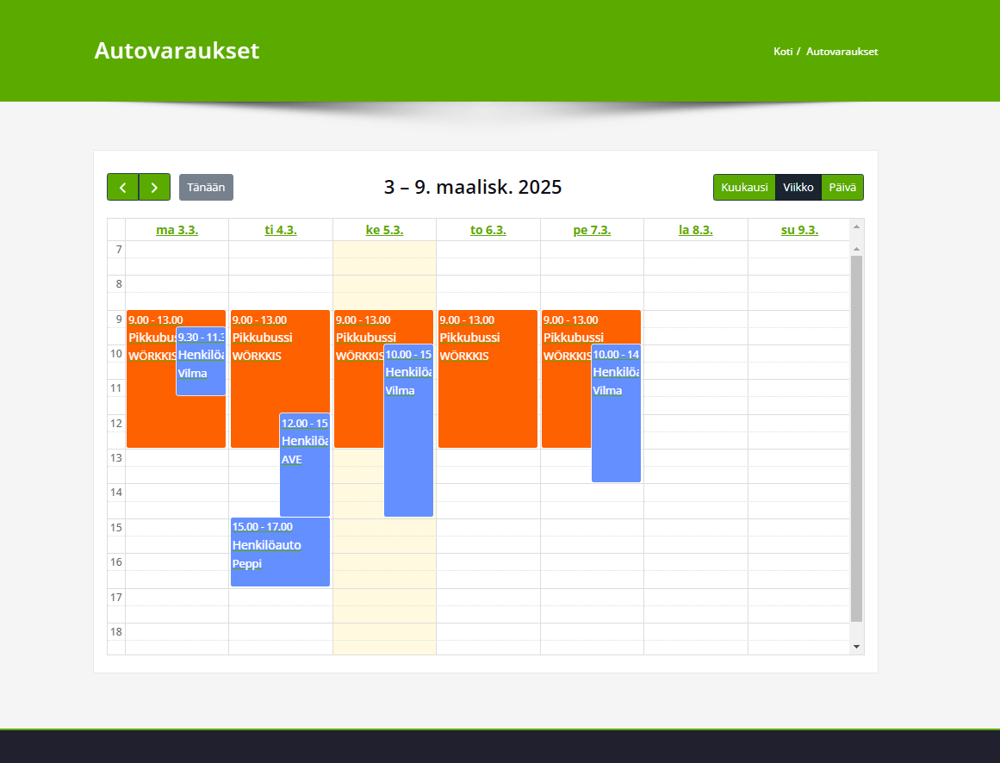
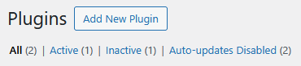
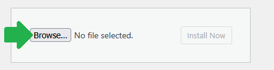
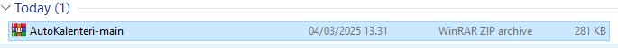
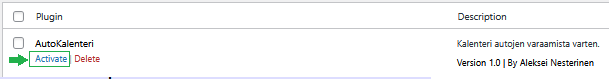

<h1 align="center"> AutoKalenteri - Wordpress plugin for car reservations </h1>

<h2 align="center"> AutoKalenteri is a simple wordpress plugin for managing car availability </h2>

<h3> Functionality: </h3>
<ul>
  <li>View reservations</li>
  <li>Create reservations</li>
  <li>Remove reservations</li>
  <li>Update reservations</li>
</ul>

<a href="https://fullcalendar.io/"> This plugin uses Fullcalendar </a>

<h3> Download & Installation </h3>
<a href="https://codeload.github.com/nesterinen/AutoKalenteri/zip/refs/heads/main"> Download(.zip) </a>

Then login to your wordpress admin site, and go to the plugins page ~/wp-admin/plugins.php

The plugin will then automatically create a <a href="github/wppages.png">page</a> and database <a href="github/table.png">table</a> for the plugin

<h3>License</h3>
This project is licensed under the MIT License

<h3>Footnote</h3>

this is my first time being in the wordpress enviroment

this is my first time using php
