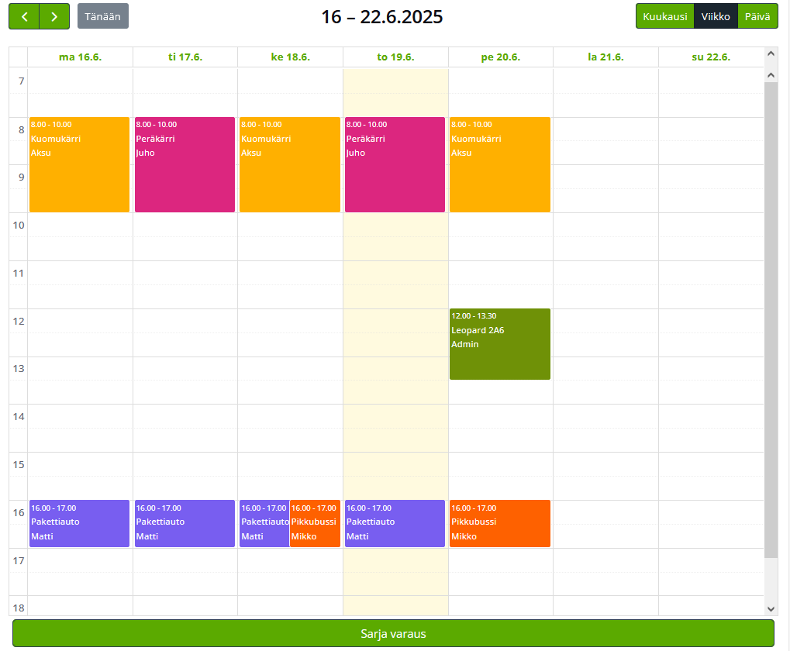
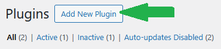
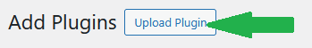

<h1 align="center"> AutoKalenteri - Wordpress plugin for Wörkkis työpaja </h1>

<h2 align="center"> AutoKalenteri is a simple wordpress plugin for managing availability of vehicles</h2>

<h3> Functionality: </h3>
<ul>
  <li>View reservations</li>
  <li>Create reservations</li>
  <li>Remove reservations</li>
  <li>Update reservations</li>
</ul>

<a href="https://fullcalendar.io/"> This plugin uses Fullcalendar </a>

<h3> -Download & Installation- </h3>
<a href="https://codeload.github.com/nesterinen/AutoKalenteri/zip/refs/heads/main"> Download(.zip) </a>

Then login to your wordpress admin site, and go to the plugins page ~/wp-admin/plugins.php

<ol>
  <li></li>
  <li></li>
  <li></li>
  <li></li>
  <li></li>
</ol>

The plugin will then automatically create a <a href="github/wppages.png">page</a> and database <a href="github/table.png">table</a> for the plugin

<h3> -Changing which vehicles are available- </h3>

List of vehicles and their respective display colors are hard coded into AutoKalenteri.php as a global variable. &#129318;

To access and modify AutoKalenteri.php in wordpress/wp-admin/plugin-editor.php

<ul>
  <li>
    <h3>DISABLE PLUGIN BEFORE EDITING FILES.</h3>
    
Go to plugin file editor

    
  </li>
  <li>
    
Select AutoKalenteri

    
  </li>
  <li>
    
Find "global $available_cars;" variable

    
  </li>
  <li>
    
Example: 'Leopard 2A6' => '#6F9107' | 'nameOfVehice' => '#hexColor'

    
  </li>
  <li>
    
Click Update to save changes.

    
  </li>
  <li>
    <h3>ENABLE PLUGIN AGAIN HERE</h3>
    
Calendar now has a new option

    
  </li>
</ul>

<h3>-License-</h3>
This project is licensed under the MIT License

<h3>-Footnote-</h3>

this is my first time being in the wordpress enviroment

this is my first time using php
